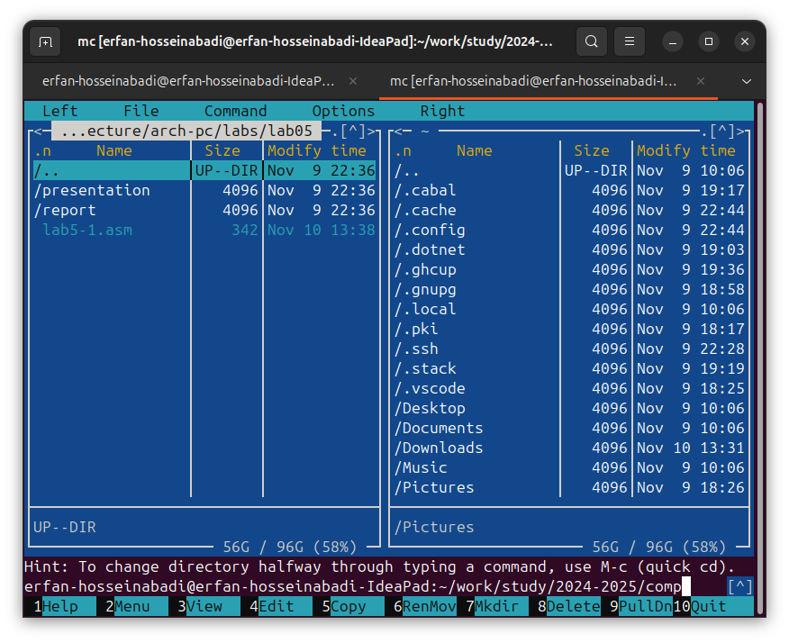

---
## Front matter
title: "labrotary work №5"
subtitle: "computer architecture"
author: "Erfan hosseinabadi"

## Generic otions
lang: en-EN
toc-title: "Content"

## Bibliography
bibliography: bib/cite.bib
csl: pandoc/csl/gost-r-7-0-5-2008-numeric.csl

## Pdf output format
toc: true # Table of contents
toc-depth: 2
lof: true # List of figures
lot: true # List of tables
fontsize: 12pt
linestretch: 1.5
papersize: a4
documentclass: scrreprt
## I18n polyglossia
polyglossia-lang:
  name: russian
  options:
	- spelling=modern
	- babelshorthands=true
polyglossia-otherlangs:
  name: english
## I18n babel
babel-lang: russian
babel-otherlangs: english
## Fonts
mainfont: IBM Plex Serif
romanfont: IBM Plex Serif
sansfont: IBM Plex Sans
monofont: IBM Plex Mono
mathfont: STIX Two Math
mainfontoptions: Ligatures=Common,Ligatures=TeX,Scale=0.94
romanfontoptions: Ligatures=Common,Ligatures=TeX,Scale=0.94
sansfontoptions: Ligatures=Common,Ligatures=TeX,Scale=MatchLowercase,Scale=0.94
monofontoptions: Scale=MatchLowercase,Scale=0.94,FakeStretch=0.9
mathfontoptions:
## Biblatex
biblatex: true
biblio-style: "gost-numeric"
biblatexoptions:
  - parentracker=true
  - backend=biber
  - hyperref=auto
  - language=auto
  - autolang=other*
  - citestyle=gost-numeric
## Pandoc-crossref LaTeX customization
figureTitle: "Рис."
tableTitle: "Таблица"
listingTitle: "Листинг"
lofTitle: "Список иллюстраций"
lotTitle: "Список таблиц"
lolTitle: "Листинги"
## Misc options
indent: true
header-includes:
  - \usepackage{indentfirst}
  - \usepackage{float} # keep figures where there are in the text
  - \floatplacement{figure}{H} # keep figures where there are in the text
---
# Objective of the Work

The objective of this laboratory work is to acquire practical skills in using Midnight Commander and to learn the basic instructions of the assembly language: `mov` and `int`.

# Task

1. Basics of working with Midnight Commander

2. Structure of a program written in NASM assembly language

3. Including an external file

4. Completing the assignments for self-study

# Theoretical Introduction

Midnight Commander (or simply mc) is a program that allows users to browse directory structures and perform basic file system management operations. Thus, mc functions as a file manager. Midnight Commander makes working with files more convenient and visually understandable.

A program written in the NASM assembly language typically consists of three sections: the program code section (SECTION .text), the initialized data section (known at compile time) (SECTION .data), and the uninitialized data section (which is allocated memory at compile time but assigned values during program execution) (SECTION .bss).

To declare initialized data in the .data section, the directives DB, DW, DD, DQ, and DT are used, which reserve memory and specify which values should be stored in that memory:

- DB (define byte) — defines a variable of 1 byte;
- DW (define word) — defines a variable of 2 bytes (word);
- DD (define double word) — defines a variable of 4 bytes (double word);
- DQ (define quad word) — defines a variable of 8 bytes (quad word);
- DT (define ten bytes) — defines a variable of 10 bytes.

## Conducting the Laboratory Work

### Basics of Working with Midnight Commander

By entering the appropriate command in the terminal (Figure -@fig:001), I open Midnight Commander (Figure -@fig:002).

{#fig:001 width=70%}

{#fig:002 width=70%}

I navigate to the directory created in the previous laboratory work (Figure -@fig:003).

{#fig:003 width=70%}

Using the function key, I create a subdirectory lab05, where I will work (Figure -@fig:004).

{#fig:004 width=70%}

In the input line, I enter the command `touch` and create a file (Figure -@fig:005).

{#fig:005 width=70%}

I use F4 to open the newly created file and enter the code from the listing (Figure -@fig:006).

{#fig:006 width=70%}

I check the saved changes using the F3 key (Figure -@fig:007).

{#fig:007 width=70%}

I compile and execute the modified file (Figure -@fig:008).

{#fig:008 width=70%}

### Connecting an External File

I save the file downloaded from TUIS to a shared folder on my computer, then in the virtual machine, I go to the directory of the shared folder, copy the file to the working subdirectory (Figure -@fig:009).

{#fig:009 width=70%}

I include subroutines from the included file in the copy of the file (Figure -@fig:011).

{#fig:011 width=70%}

I translate, compose, and launch the program with the included file (Figure -@fig:012).

{#fig:012 width=70%}

I edit the file and replace the `sprintLF` subroutine with `sprint`. The difference between the two subroutines is that the second one prompts the input on the same line (Figure -@fig:013).

{#fig:013 width=70%}

## Self-Study Task

I create a copy of `lab5-1.asm`, editing it so that the string I entered from the keyboard is displayed at the end (Figure -@fig:014).

{#fig:014 width=70%}

I translate, compose, and run my program (Figure -@fig:015).

{#fig:015 width=70%}

Here is the code:

```nasm
SECTION .data
msg: DB 'write a string:', 10
msgLen: EQU $-msg

SECTION .bss
buf1: RESB 80

SECTION .text
GLOBAL _start

_start:
    mov     eax, 4
    mov     ebx, 1
    mov     ecx, msg
    mov     edx, msgLen
    int     80h

    mov     eax, 3
    mov     ebx, 0
    mov     ecx, buf1
    mov     edx, 80
    int     80h

    mov     eax, 4
    mov     ebx, 1
    mov     ecx, buf1
    mov     edx, buf1
    int     80h

    mov     eax, 1
    mov     ebx, 0
    int     80h
```

I create a copy of lab5-2.asm, edit it so that the line I entered from the keyboard is displayed at the end (Fig. -@fig:016).

{#fig:016 width=70%}

I translate, compose and run my program (Fig. -@fig:017).

{#fig:017 width=70%}

code:

```NASM
%include 'in_out.asm'

SECTION .data

msg: DB 'write a string: ', 0h
msgLen: EQU $-msg

SECTION .bss
buf1: RESB 80

SECTION .text
	GLOBAL _start
	_start:

	mov eax, msg
	call sprint

	mov ecx, buf1
	mov edx, 80

	call sread

	mov eax, 4
	mov ebx, 1
	mov ecx, buf1
	int 80h

	call quit
```

# Conclusions

During this lab I gained practical skills in working in Midnight Commander and also mastered the assembly language instructions mov and int.

# References{.unnumbered}

1. [sample](https://github.com/evdvorkina/study_2022-2023_arh-pc/blob/master/labs/lab06/report/%D0%9B06_%D0%94%D0%B2%D0%BE%D1%80%D0%BA%D0%B8%D0%BD%D0%B0_%D0%BE%D1%82%D1%87%D0%B5%D1%82.md?plain=1)
2. [course on tuis](https://esystem.rudn.ru/course/view.php?id=112)
3. [labrotary work №5](https://esystem.rudn.ru/pluginfile.php/2089085/mod_resource/content/0/%D0%9B%D0%B0%D0%B1%D0%BE%D1%80%D0%B0%D1%82%D0%BE%D1%80%D0%BD%D0%B0%D1%8F%20%D1%80%D0%B0%D0%B1%D0%BE%D1%82%D0%B0%20%E2%84%965.%20%D0%9E%D1%81%D0%BD%D0%BE%D0%B2%D1%8B%20%D1%80%D0%B0%D0%B1%D0%BE%D1%82%D1%8B%20%D1%81%20Midnight%20Commander%20%28%29.%20%D0%A1%D1%82%D1%80%D1%83%D0%BA%D1%82%D1%83%D1%80%D0%B0%20%D0%BF%D1%80%D0%BE%D0%B3%D1%80%D0%B0%D0%BC%D0%BC%D1%8B%20%D0%BD%D0%B0%20%D1%8F%D0%B7%D1%8B%D0%BA%D0%B5%20%D0%B0%D1%81%D1%81%D0%B5%D0%BC%D0%B1%D0%BB%D0%B5%D1%80%D0%B0%20NASM.%20%D0%A1%D0%B8%D1%81%D1%82%D0%B5%D0%BC%D0%BD%D1%8B%D0%B5%20%D0%B2%D1%8B%D0%B7%D0%BE%D0%B2%D1%8B%20%D0%B2%20%D0%9E%D0%A1%20GNU%20Linux.pdf)
4. [prograaming in nasmlanguage](https://esystem.rudn.ru/pluginfile.php/2088953/mod_resource/content/2/%D0%A1%D1%82%D0%BE%D0%BB%D1%8F%D1%80%D0%BE%D0%B2%20%D0%90.%20%D0%92.%20-%20%D0%9F%D1%80%D0%BE%D0%B3%D1%80%D0%B0%D0%BC%D0%BC%D0%B8%D1%80%D0%BE%D0%B2%D0%B0%D0%BD%D0%B8%D0%B5%20%D0%BD%D0%B0%20%D1%8F%D0%B7%D1%8B%D0%BA%D0%B5%20%D0%B0%D1%81%D1%81%D0%B5%D0%BC%D0%B1%D0%BB%D0%B5%D1%80%D0%B0%20NASM%20%D0%B4%D0%BB%D1%8F%20%D0%9E%D0%A1%20Unix.pdf)
