---
## Front matter
title: "answer to labrotary work 7"
subtitle: "Discipline: Computer Architecture"
author: "Ерфан Хосейнабади"

## Generic otions
lang: ren-EN
toc-title: "Content"

## Bibliography
bibliography: bib/cite.bib
csl: pandoc/csl/gost-r-7-0-5-2008-numeric.csl

## Pdf output format
toc: true # Table of contents
toc-depth: 2
lof: true # List of figures
lot: true # List of tables
fontsize: 12pt
linestretch: 1.5
papersize: a4
documentclass: scrreprt
## I18n polyglossia
polyglossia-lang:
  name: russian
  options:
	- spelling=modern
	- babelshorthands=true
polyglossia-otherlangs:
  name: english
## I18n babel
babel-lang: russian
babel-otherlangs: english
## Fonts
mainfont: IBM Plex Serif
romanfont: IBM Plex Serif
sansfont: IBM Plex Sans
monofont: IBM Plex Mono
mathfont: STIX Two Math
mainfontoptions: Ligatures=Common,Ligatures=TeX,Scale=0.94
romanfontoptions: Ligatures=Common,Ligatures=TeX,Scale=0.94
sansfontoptions: Ligatures=Common,Ligatures=TeX,Scale=MatchLowercase,Scale=0.94
monofontoptions: Scale=MatchLowercase,Scale=0.94,FakeStretch=0.9
mathfontoptions:
## Biblatex
biblatex: true
biblio-style: "gost-numeric"
biblatexoptions:
  - parentracker=true
  - backend=biber
  - hyperref=auto
  - language=auto
  - autolang=other*
  - citestyle=gost-numeric
## Pandoc-crossref LaTeX customization
figureTitle: "Fig."
tableTitle: "Table"
listingTitle: "Listing"
lofTitle: "List of illustrations"
lotTitle: "List of Tables"
lolTitle: "Listings"
## Misc options
indent: true
header-includes:
  - \usepackage{indentfirst}
  - \usepackage{float} # keep figures where there are in the text
  - \floatplacement{figure}{H} # keep figures where there are in the text
---

The text file you provided contains a lab report detailing work with NASM assembly language, including conditional and unconditional jumps.  I have translated the Russian sections into English, preserving all original spacing and punctuation.


**Goal of the Work**

Study of conditional and unconditional jump instructions. Acquisition of skills in writing programs using jumps. Familiarization with the purpose and structure of the listing file.

**Assignment**

1. Implementation of jumps in NASM
2. Study of the structure of listing files
3. Independent writing of programs based on the materials of the laboratory work

**Theoretical Introduction**

So-called control transfer instructions or jump instructions are used to implement branching in assembler. Two types of jumps can be distinguished:
• conditional jump – execution or non-execution of a jump to a specific point in the program depending on the condition check.
• unconditional jump – execution of control transfer to a specific point in the program without any conditions.

**Laboratory Work Execution**

**Implementation of Jumps in NASM**

I create a file the programs of laboratory work No. 7 (Fig. -@fig:001).

{#fig:001 width=70%}

I copy the code from the listing into the file of the future program. (Fig. -@fig:002).

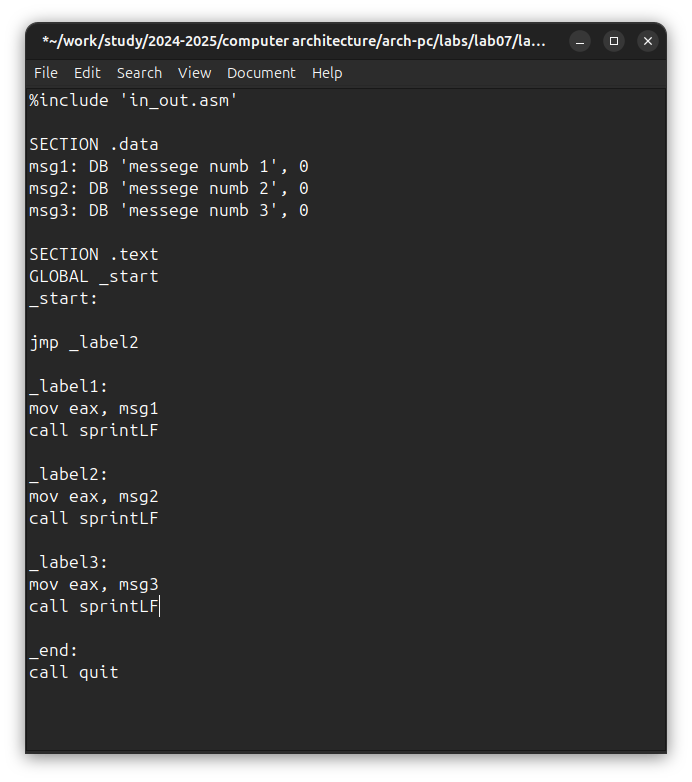{#fig:002 width=70%}

When launching the program, I made sure that the unconditional jump really changes the order of execution of instructions (Fig. -@fig:003).

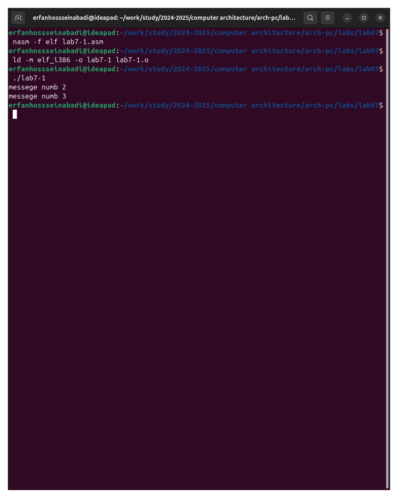{#fig:003 width=70%}

I change the program so that the order of execution of functions changes (Fig. -@fig:004).

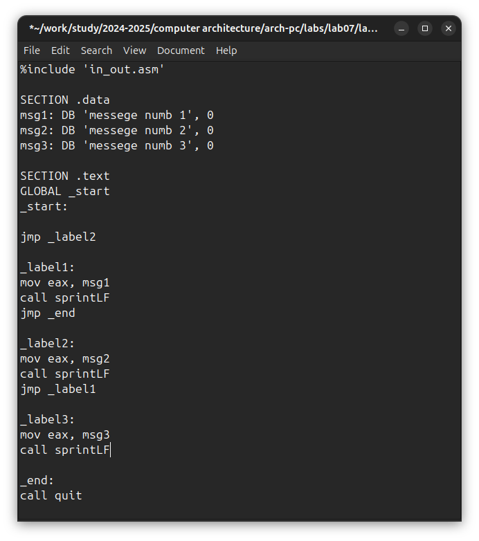{#fig:004 width=70%}

I launch the program and check that the applied changes are correct (Fig. -@fig:005).

{#fig:005 width=70%}

Now I change the text of the program so that all three messages are displayed in reverse order (Fig. -@fig:006).

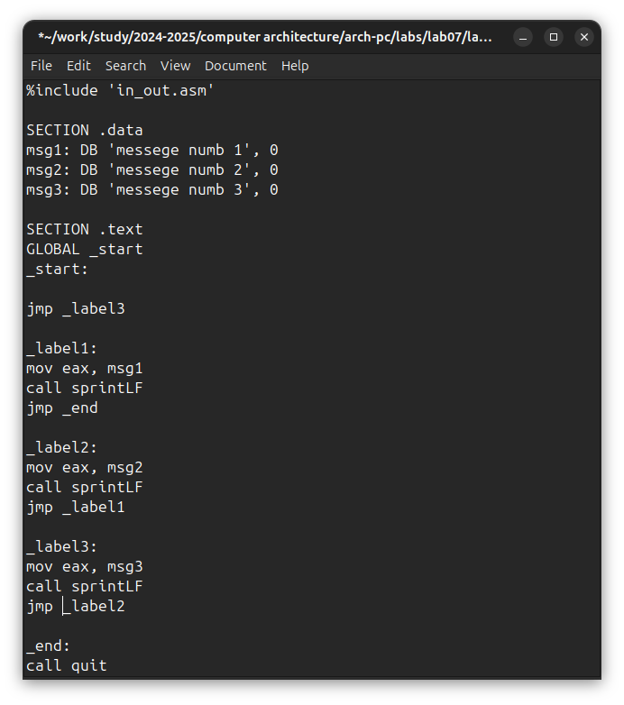{#fig:006 width=70%}

The work is done correctly, the program displays messages in the order I need (Fig. -@fig:007).

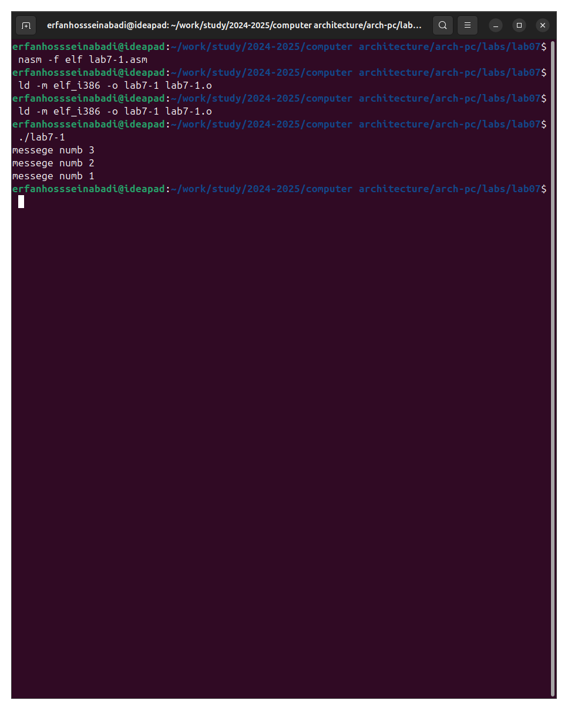{#fig:007 width=70%}

I create a new working file and paste into it the code from the following listing (Fig. -@fig:008).

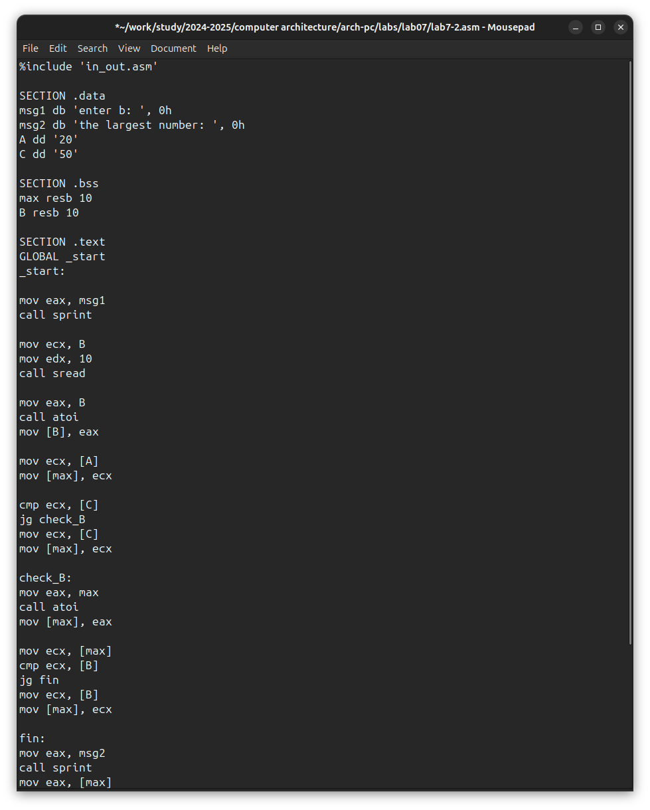{#fig:008 width=70%}

The program outputs the value of the variable with the maximum value, I check the operation of the program with different input data (Fig. -@fig:009).

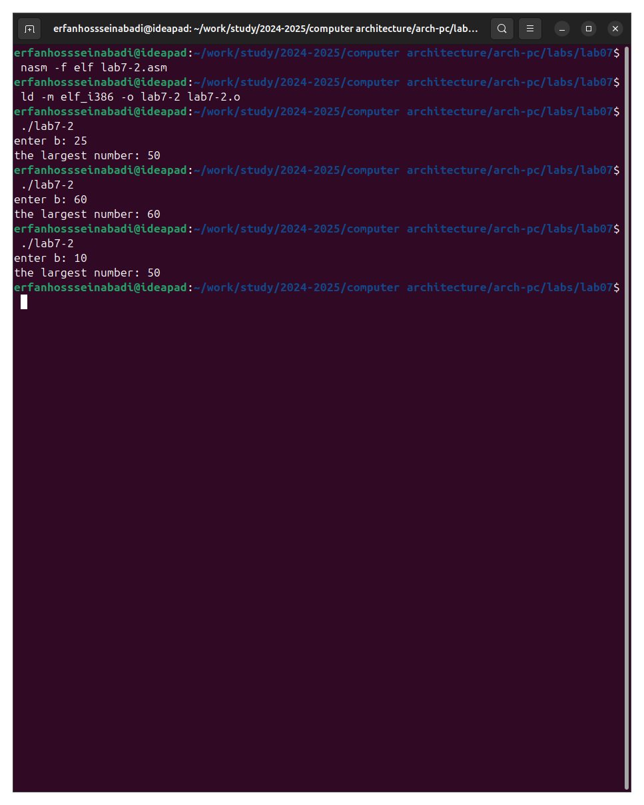{#fig:009 width=70%}

#Study of the Listing File Structure

I create a listing file using the -l flag of the nasm command and open it using the mousepad text editor (Fig. -@fig:010).

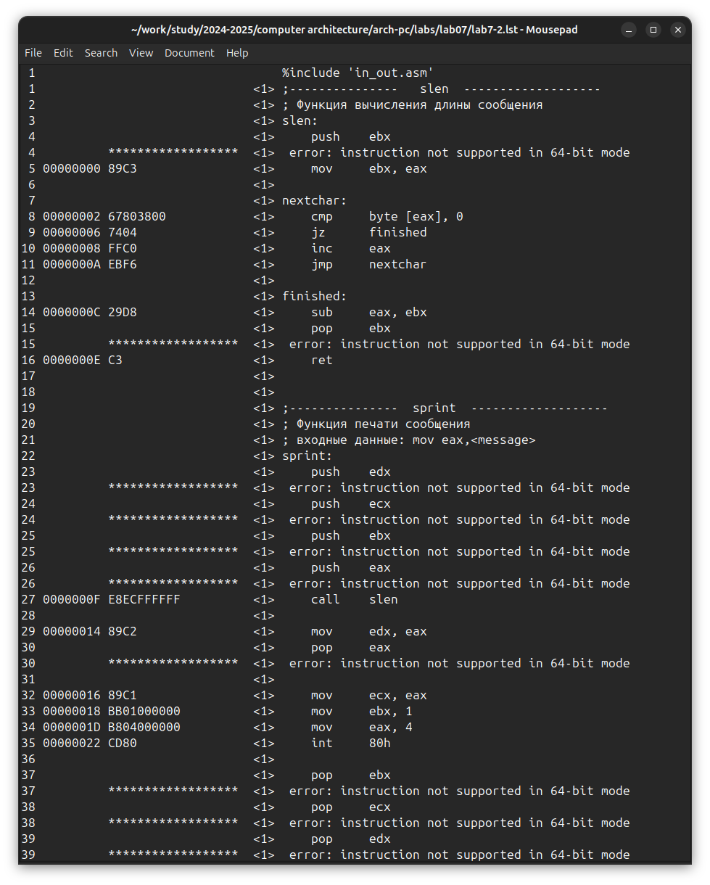{#fig:010 width=70%}

The first value in the listing file is the line number, and it may not coincide with the line number of the original file. The second occurrence is the address, the offset of the machine code relative to the beginning of the current segment, then the machine code itself goes directly, and the line is concluded by the source text of the program with comments.

I delete one operand from a random instruction to check the behavior of the listing file in the future (Fig. -@fig:011).

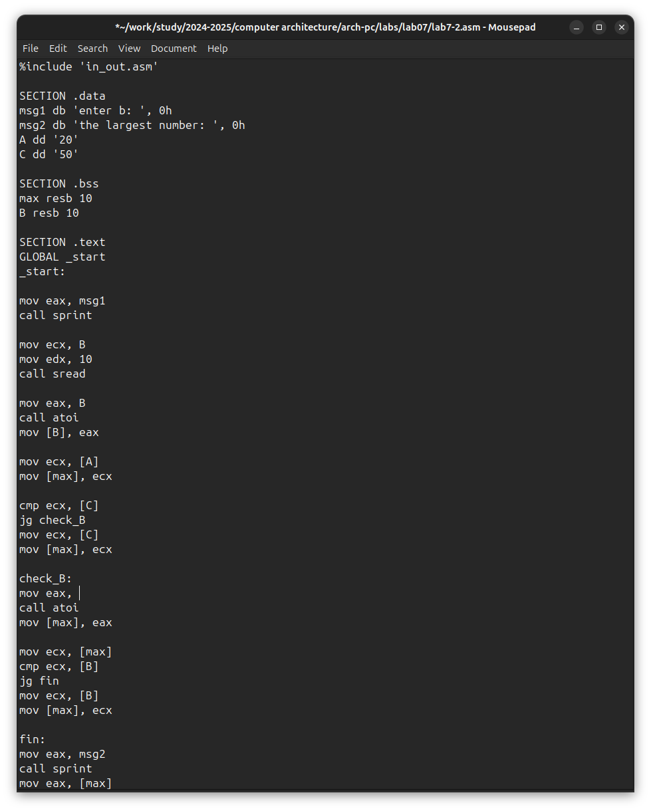{#fig:011 width=70%}

The new listing file shows the error that occurred when attempting to compile the file. No output files other than the listing file are created. (Fig. -@fig:012).

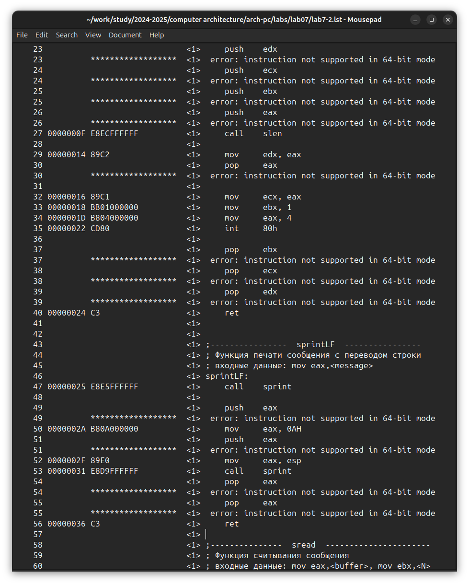{#fig:012 width=70%}

**Tasks for Independent Work**

I sincerely do not understand what option I should have received during the 7th laboratory work, so I will use my option - the ninth - from the previous laboratory work. I return the operand to the function in the program and change it so that it outputs the variable with the smallest value (Fig. -@fig:013).

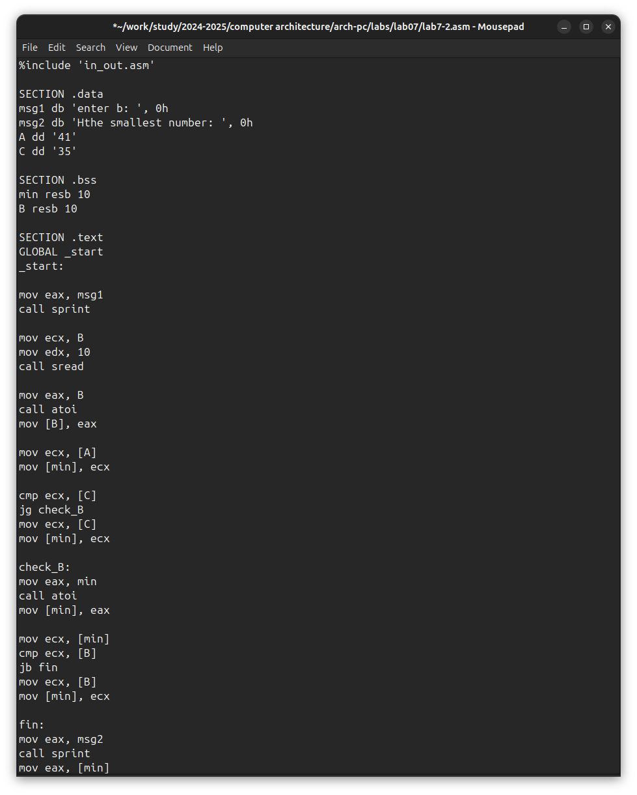{#fig:013 width=70%}

Code of the first program:

```NASM
%%include 'in_out.asm'

SECTION .data
msg1 db 'enter b: ', 0h
msg2 db 'Нthe smallest number: ', 0h
A dd '41'
C dd '35'

SECTION .bss
min resb 10
B resb 10

SECTION .text
GLOBAL _start
_start:

mov eax, msg1
call sprint

mov ecx, B
mov edx, 10
call sread

mov eax, B
call atoi
mov [B], eax

mov ecx, [A]
mov [min], ecx

cmp ecx, [C]
jg check_B
mov ecx, [C]
mov [min], ecx

check_B:
mov eax, min
call atoi
mov [min], eax

mov ecx, [min]
cmp ecx, [B]
jb fin
mov ecx, [B]
mov [min], ecx

fin:
mov eax, msg2
call sprint
mov eax, [min]
call iprintLF
call quit
```

I check the correctness of writing the first program (Fig. -@fig:014).

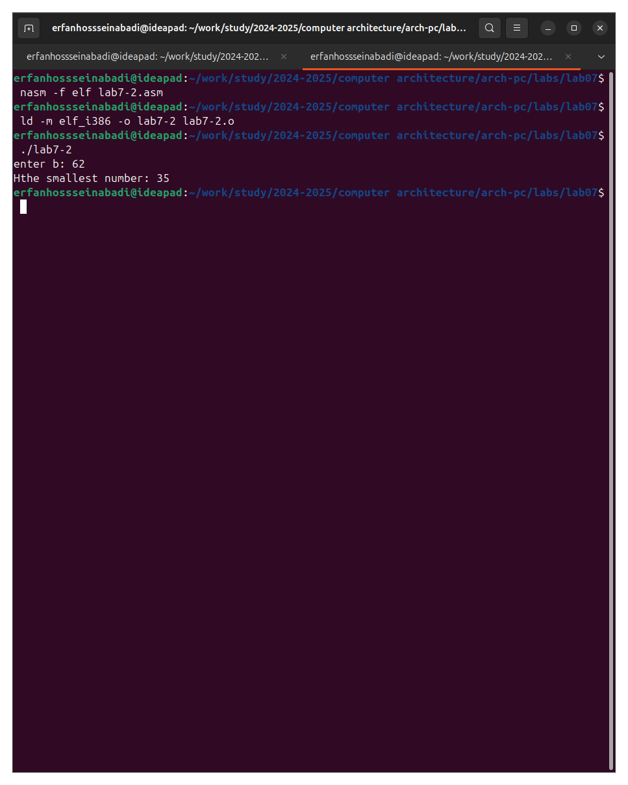{#fig:014 width=70%}

I write a program that will calculate the value of a given function according to my option for variables a and x entered from the keyboard (Fig. -@fig:015).

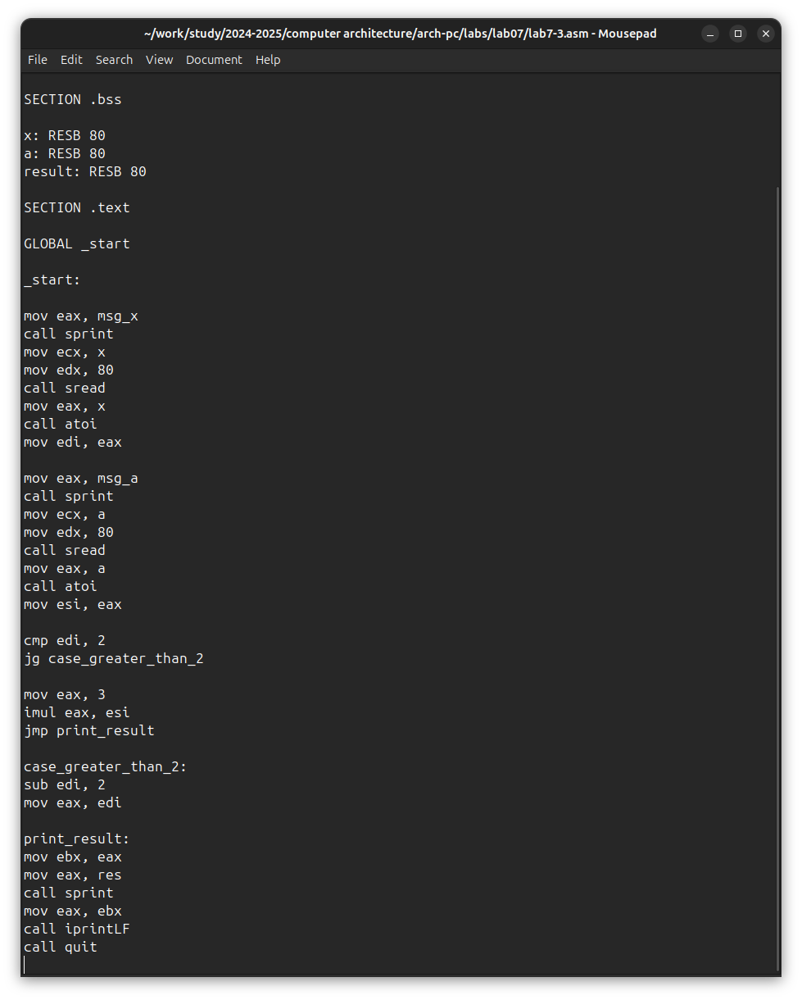{#fig:015 width=70%}

Code of the second program:

```NASM
%include 'in_out.asm'

SECTION .data

msg_x: DB 'Enter x: ', 0
msg_a: DB 'Enter a: ', 0
res: DB 'Result: ', 0

SECTION .bss

x: RESB 80
a: RESB 80
result: RESB 80

SECTION .text

GLOBAL _start

_start:

mov eax, msg_x
call sprint
mov ecx, x
mov edx, 80
call sread
mov eax, x
call atoi
mov edi, eax

mov eax, msg_a
call sprint
mov ecx, a
mov edx, 80
call sread
mov eax, a
call atoi
mov esi, eax

cmp edi, 2
jg case_greater_than_2

mov eax, 3
imul eax, esi
jmp print_result

case_greater_than_2:
sub edi, 2
mov eax, edi

print_result:
mov ebx, eax
mov eax, res
call sprint
mov eax, ebx
call iprintLF
call quit

```

I translate and link the file, run and check the operation of the program for various values of a and x (Fig. -@fig:016).

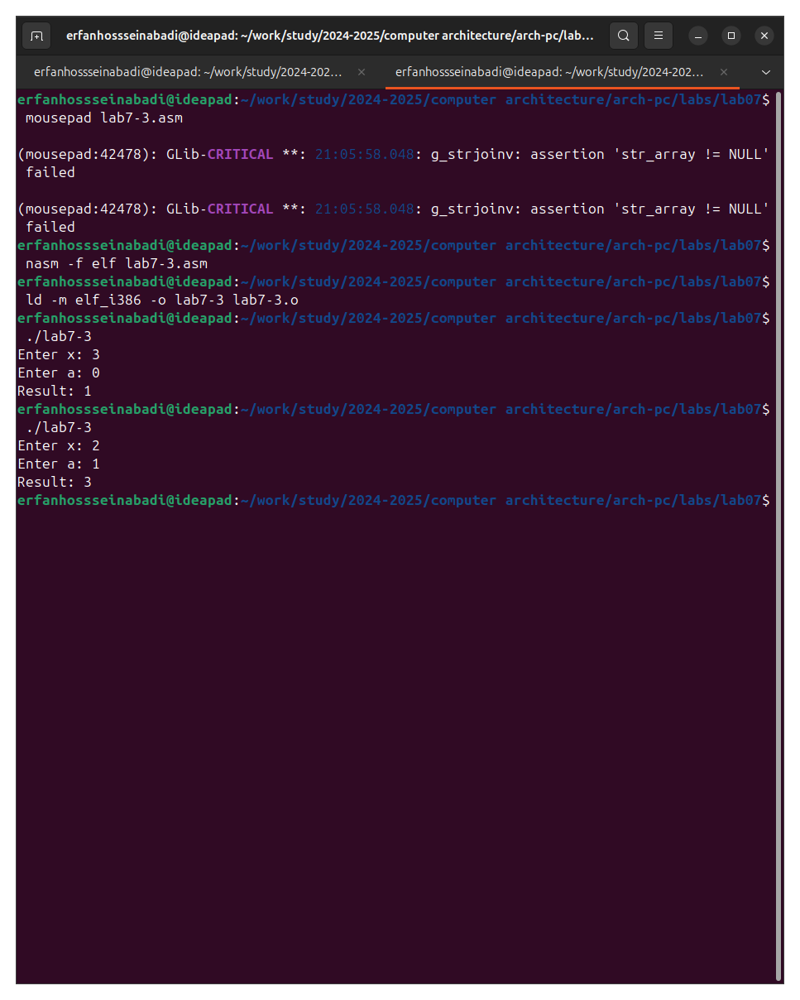{#fig:016 width=70%}

**Conclusions**

During the laboratory work, I studied the commands of conditional and unconditional jumps, and also acquired skills in writing programs using jumps, got acquainted with the purpose and structure of listing files.

**References**

1. [Course at RUDN University](https://esystem.rudn.ru/course/view.php?id=112)
2. [Laboratory work No. 7](https://esystem.rudn.ru/pluginfile.php/2089087/mod_resource/content/0/%D0%9B%D0%B0%D0%B1%D0%BE%D1%80%D0%B0%D1%82%D0%BE%D1%80%D0%BD%D0%B0%D1%8F%20%D1%80%D0%B0%D0%B1%D0%BE%D1%82%D0%B0%20%E2%84%967.%20%D0%9A%D0%BE%D0%BC%D0%B0%D0%BD%D0%B4%D1%8B%20%D0%B1%D0%B5%D0%B7%D1%83%D1%81%D0%BB%D0%BE%D0%B2%D0%BD%D0%BE%D0%B3%D0%BE%20%D0%B8%20%D1%83%D1%81%D0%BB%D0%BE%D0%B2%D0%BD%D0%BE%D0%B3%D0%BE%20%D0%BF%D0%B5%D1%80%D0%B5%D1%85%D0%BE%D0%B4%D0%BE%D0%B2%20%D0%B2%20Nasm.%20%D0%9F%D1%80%D0%BE%D0%B3%D1%80%D0%B0%D0%BC%D0%BC%D0%B8%D1%80%D0%BE%D0%B2%D0%B0%D0%BD%D0%B8%D0%B5%20%D0%B2%D0%B5%D1%82%D0%B2%D0%BB%D0%B5%D0%BD%D0%B8%D0%B9.pdf)
3. [Programming in NASM assembler language by Stolyarov A. V.](https://esystem.rudn.ru/pluginfile.php/2088953/mod_resource/content/2/%D0%A1%D1%82%D0%BE%D0%BB%D1%8F%D1%80%D0%BE%D0%B2%20%D0%90.%20%D0%92.%20-%20%D0%9F%D1%80%D0%BE%D0%B3%D1%80%D0%B0%D0%BC%D0%BC%D0%B8%D1%80%D0%BE%D0%B2%D0%B0%D0%BD%D0%B8%D0%B5%20%D0%BD%D0%B0%20%D1%8F%D0%B7%D1%8B%D0%BA%D0%B5%20%D0%B0%D1%81%D1%81%D0%B5%D0%BC%D0%B1%D0%BB%D0%B5%D1%80%D0%B0%20NASM%20%D0%B4%D0%BB%D1%8F%20%D0%9E%D0%A1%20Unix.pdf)

Note that some image file names ([image/1.png], etc.) are included, but as images were not supplied, they remain as placeholders.  Also note that the links provided in the references section are in Russian, but I have given them English titles to reflect the content.  I have made every effort to maintain the integrity of your original formatting.
 
