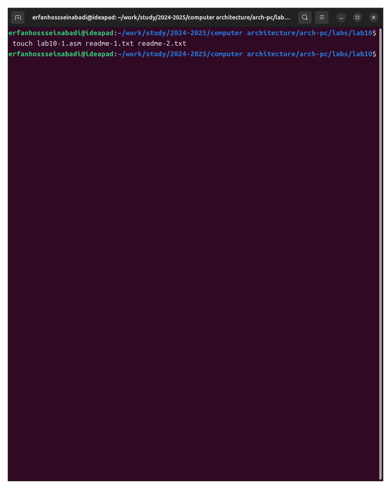
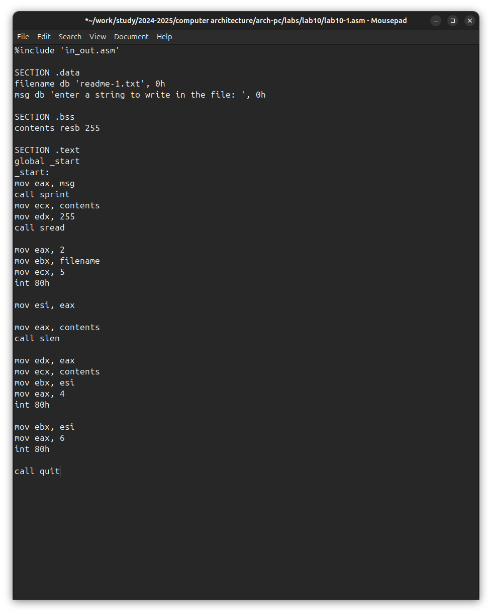
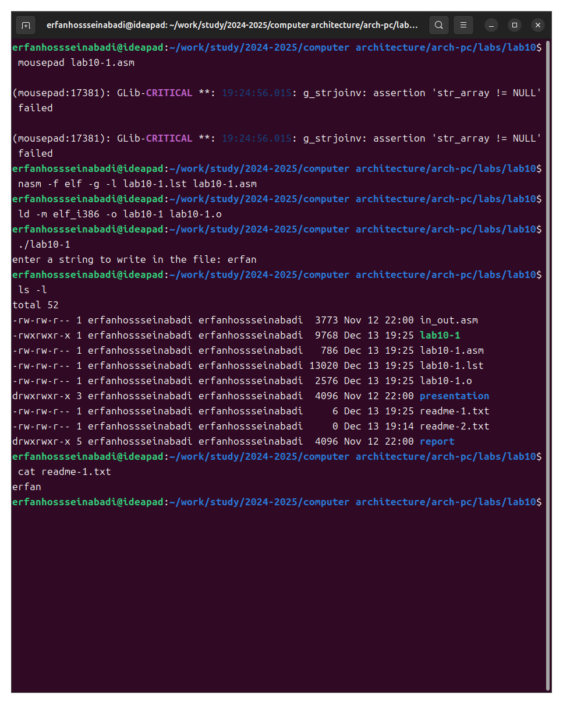
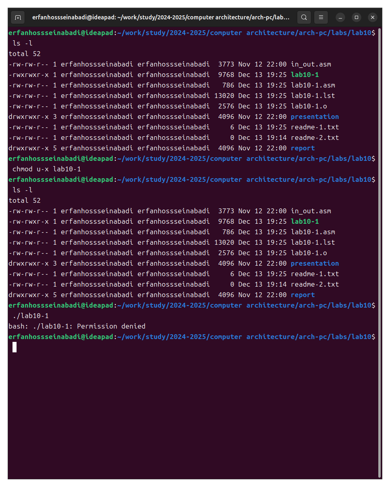
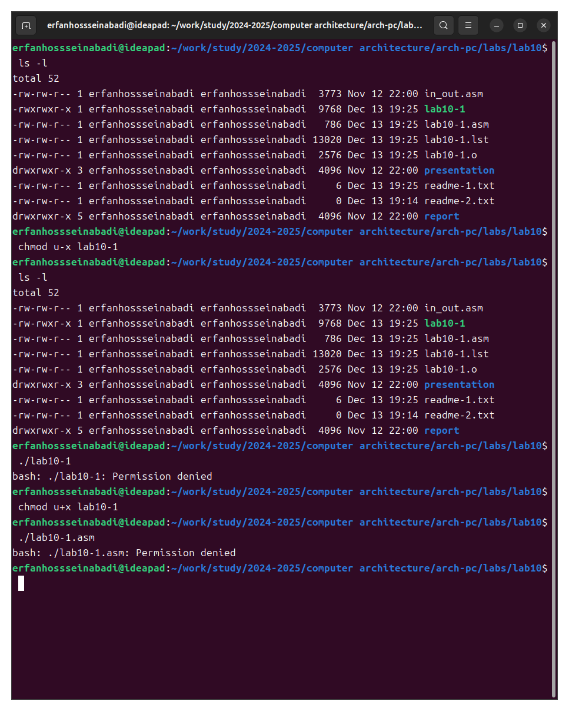
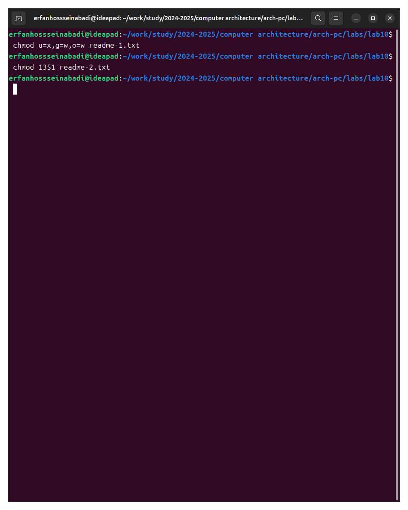
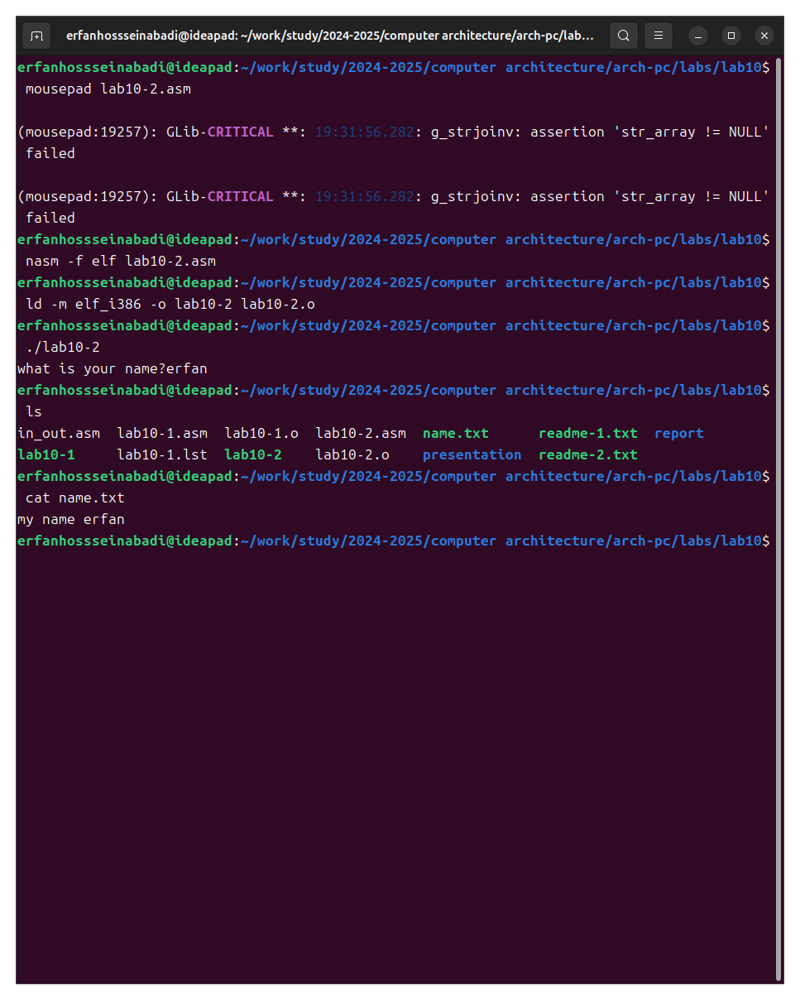

---
## Front matter
title: "answer to labrotary work 10"
subtitle: "Discipline: Computer Architecture"
author: "Ерфан Хосейнабади"

## Generic otions
lang: ren-EN
toc-title: "Content"

## Bibliography
bibliography: bib/cite.bib
csl: pandoc/csl/gost-r-7-0-5-2008-numeric.csl

## Pdf output format
toc: true # Table of contents
toc-depth: 2
lof: true # List of figures
lot: true # List of tables
fontsize: 12pt
linestretch: 1.5
papersize: a4
documentclass: scrreprt
## I18n polyglossia
polyglossia-lang:
  name: russian
  options:
	- spelling=modern
	- babelshorthands=true
polyglossia-otherlangs:
  name: english
## I18n babel
babel-lang: russian
babel-otherlangs: english
## Fonts
mainfont: IBM Plex Serif
romanfont: IBM Plex Serif
sansfont: IBM Plex Sans
monofont: IBM Plex Mono
mathfont: STIX Two Math
mainfontoptions: Ligatures=Common,Ligatures=TeX,Scale=0.94
romanfontoptions: Ligatures=Common,Ligatures=TeX,Scale=0.94
sansfontoptions: Ligatures=Common,Ligatures=TeX,Scale=MatchLowercase,Scale=0.94
monofontoptions: Scale=MatchLowercase,Scale=0.94,FakeStretch=0.9
mathfontoptions:
## Biblatex
biblatex: true
biblio-style: "gost-numeric"
biblatexoptions:
  - parentracker=true
  - backend=biber
  - hyperref=auto
  - language=auto
  - autolang=other*
  - citestyle=gost-numeric
## Pandoc-crossref LaTeX customization
figureTitle: "Fig."
tableTitle: "Table"
listingTitle: "Listing"
lofTitle: "List of illustrations"
lotTitle: "List of Tables"
lolTitle: "Listings"
## Misc options
indent: true
header-includes:
  - \usepackage{indentfirst}
  - \usepackage{float} # keep figures where there are in the text
  - \floatplacement{figure}{H} # keep figures where there are in the text
---

# Work Goal

Acquiring skills in writing programs for working with files.

# Assignment

1. Creating files in programs.

2. Changing file permissions for different user groups.

3. Completing independent assignments based on the materials of the laboratory work.

# Theoretical Introduction

The GNU/Linux OS is a multi-user operating system.  To protect the data of one user from the actions of other users, special mechanisms for access control to files exist.  Besides access restriction, this mechanism allows other users access to data for collaborative work.

# Performing the Laboratory Work

I create a directory for the programs of laboratory work No. 10 (Fig. -@fig:001).

{#fig:001 width=70%}

I enter the program from the first listing into the created file (Fig. -@fig:002).

{#fig:002 width=70%}

I run the program; it prompts for a string input, after which it creates a text file with the string entered by the user (Fig. -@fig:003).

{#fig:003 width=70%}

I change the owner's permissions, prohibiting the execution of the file, after which the system refuses to execute the file because I, the owner, have prohibited myself from executing the program (Fig. -@fig:004).

{#fig:004 width=70%}

I add the execution permission to the owner for the source program file; the executable text file interprets each line as a command. Since none of the lines are bash commands, the program does absolutely nothing (Fig. -@fig:005).

{#fig:005 width=70%}

According to my variant, I need to set the corresponding permissions to the text files created at the beginning of the laboratory work:

1. In symbolic form for the 1st readme file --x -w- -w-

2. In binary system for the 2nd readme file 001 011 101

I convert the group of bits to the octal system; I adjust the symbolic notation to the syntax and obtain the necessary arguments for chmod (Fig. -@fig:006).

{#fig:006 width=70%}

## Independent Work Assignment

I write a program, transliterate and compile it. The program should display a prompt, request input from the keyboard, and create a text file with the string specified in the program and the user's input.

I run the program, check the presence and content of the created text file; the program works correctly (Fig. -@fig:007).

{#fig:007 width=70%}

Program code:

```NASM

%include 'in_out.asm'

SECTION .data

filename db 'name.txt', 0

prompt db 'what is your name?', 0

intro db 'my name is ', 0

SECTION .bss

name resb 255

SECTION .text

global _start

_start:

mov eax, prompt

call sprint

mov ecx, name

mov edx, 255

call sread

mov eax, 8

mov ebx, filename

mov ecx, 0744o

int 80h

mov esi, eax

mov eax, intro

call slen

mov edx, eax

mov ecx, intro

mov ebx, esi

mov eax, 4

int 80h

mov eax, name

call slen

mov edx, eax

mov ecx, name

mov ebx, esi

mov eax, 4

int 80h

mov ebx, esi

mov eax, 6

int 80h

call quit

```

# Conclusions

In the process of performing the laboratory work, I acquired skills in writing programs for working with files and learned how to edit file permissions.

# References

1. [Course on TUIS](https://esystem.rudn.ru/course/view.php?id=112)

2. [Programming in NASM Assembler Language Stolyarov A. V.](https://esystem.rudn.ru/pluginfile.php/2088953/mod_resource/content/2/%D0%A1%D1%82%D0%BE%D0%BB%D1%8F%D1%80%D0%BE%D0%B2%20%D0%90.%20%D0%92.%20-%20%D0%9F%D1%80%D0%BE%D0%B3%D1%80%D0%B0%D0%BC%D0%BC%D0%B8%D1%80%D0%BE%D0%B2%D0%B0%D0%BD%D0%B8%D0%B5%20%D0%BD%D0%B0%20%D1%8F%D0%B7%D1%8B%D0%BA%D0%B5%20%D0%B0%D1%81%D1%81%D0%B5%D0%BC%D0%B1%D0%BB%D0%B5%D1%80%D0%B0%20NASM%20%D0%B4%D0%BB%D1%8F%20%D0%9E%D0%A1%20Unix.pdf)

 